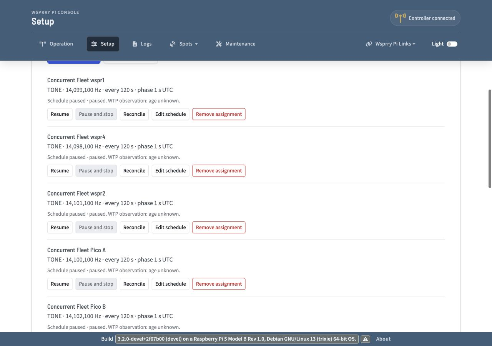

# Concurrent Pi/Pico Fleet preparation

2026-10-01. WsprryPi `devel`, source commit
`6a32789cfb84881df9e6839b27a9538f69e7bed1`.

Preparation is complete for five physical remote targets and the central Pi's
separate local schedule. **Every remote assignment is paused, local Enable is
off, and no CLAIM, LOAD or ARM was submitted during preparation.** This is a
preparation record; concurrent RF and failure/discovery acceptance remain to run.

The subsequent [execution report](wtp-concurrent-fleet-report.md) records three
successful five-target remote slots, SDR observation of the current group,
restored paused state, and the unresolved central-local RP1/browser-stop paths.

## Prepared devices

| Device | Role | Output | Listener/interface | Prepared state |
| --- | --- | --- | --- | --- |
| wspr5 | Central controller, SDR host and local WSPR schedule | RP1 GPIO20 | Plain LAN 31417, eth0, 192.168.1.54 | Five remote assignments paused; local Enable off. |
| wspr1 | Remote Pi | GPIO4 | Plain LAN 31417, wlan0, 192.168.1.44 | Managed service active, advertised, idle and unowned. |
| wspr2 | Remote Pi | GPIO4 | Plain LAN 31417, wlan0, 192.168.1.123 | Managed service active, advertised, idle and unowned. |
| wspr4 | Remote Pi | GPIO4 | Plain LAN 31417, wlan1, 192.168.1.120 | Existing validated managed service retained, advertised, idle and unowned. |
| Pico A | Remote Pico | PIO GP2 | Plain LAN 31417, wsprrypico-0a60df.local | RF-capable image loaded; disabled, idle and unowned. |
| Pico B | Remote Pico | PIO GP2 | Plain LAN 31417, wsprrypico-0a9d89.local | Prepared after handback; disabled, idle and unowned. |

All selected physical outputs are GP/GPIO. Si5351 is not part of this campaign.
The four Pis use `Enable on Boot = Never`; their independent inbound WTP
listeners remain enabled. Listener admission does not enable local transmission.

Each saved profile came from an Ethernet-side DNS-SD candidate, a bounded
identity probe and explicit Plain LAN consent. The complete device IDs are
retained in [the final configuration](wtp-fleet-preparation-results/final-preparation.json).
The central Pi is not assigned to its own Fleet. Adding remote profiles did not
change its local backend to WTP.

## Paused schedules and observation groups

The five remote jobs are finite ten-second TONE jobs, repeated every 120 seconds
at UTC phase one second. Each saved assignment has `enabled=false`,
`in_flight=false` and `last_start_ns="0"`.

| Output | Planned RF frequency | Current combiner connection |
| --- | --- | --- |
| wspr4 GPIO4 | 14.098100 MHz | Connected. |
| wspr1 GPIO4 | 14.099100 MHz | Connected. |
| Pico A PIO2 | 14.100100 MHz | Not in the current observation group. |
| wspr2 GPIO4 | 14.101100 MHz | Not in the current observation group. |
| Pico B PIO2 | 14.102100 MHz | Connected. |
| wspr5 local GPIO20 | 14.097100 MHz WSPR base | Not in the current observation group. |

The operator confirmed the current four combiner taps: **wspr1 GPIO4, Pico B
PIO2, wspr4 GPIO4 and the SDR attached to wspr5**. This is the first RF observation
group. The planned second group is wspr2, Pico A and wspr5 local output, with
cable changes between stopped runs. The corresponding SDR signal is the agreed
RF acceptance criterion; this record does not add whole-chain qualification.

wspr5's separate local configuration is WSPR, AA0NT / EM18, 20 dBm message
metadata, `20m`, with random offset disabled. It remains disabled. Its existing
RP1 gate requires a fresh exact-operation development confirmation at launch;
the [bounded launch and stop plan](wtp-fleet-preparation-results/local-rp1-launch-plan.json)
retains that step. No RP1 authorization bypass was added. A local WSPR frame is
110.592 seconds; the test controller must disable local output after the intended
bounded frame and pause/stop each remote output at the batch boundary.

The operator explicitly approved `Allow Unqualified Frequency=true` in wspr5's
`[Experimental]` INI section for this Fleet test. Its original value is retained
in the private rollback archive. No non-amateur-frequency override was enabled.
The documented WTP controller policy requires this override even for saving a
paused assignment. The public HTTP config representation does not expose this
setting; it was applied through the INI and a managed restart.

## Changes and retained rollback state

- wspr1 received an ARMv6/Bookworm binary built from current `devel` with the
  canonical `containers/build-artifact.sh armv6 bookworm` entry point. Its missing
  `libavahi-client3` runtime dependency was installed. The artifact's ARMv6,
  VFPv2 and hard-float checks passed; all shared libraries resolved on wspr1.
  Its binary SHA-256 is
  `a1a26721631156cc13c1ba41c1e89dab797b70d963a68bacf80a0aa49f4ddc68`.
  Build metadata reports commit `6a32789` and `MAKE_DIRTY=true` from the cached
  container build workspace. The application checkout itself was clean.
- wspr2 and wspr5 received the retained native validation binary already running
  on wspr4, SHA-256
  `7f8bff3fffd9a3cd3a87efcc6d66c419590398e153c956244605ef29e42c3ad9`.
  Its version string retains `2f67b00`; all 21 source-overlay hashes in
  [the native manifest](wtp-native-recovery-results/source-manifest.json) were
  checked against current `devel`. Binary identity and the source overlay are
  recorded separately from that version string.
- wspr1 and wspr2 now explicitly select GPIO4. wspr4's working GPIO4 configuration
  was backed up without replacement or restart. wspr5 retains its existing
  GPIO20 route, GPS/PPS time services and Ethernet management path.
- wspr5's older installed UI was replaced transactionally with the tracked UI
  from commit `6a32789`. The publisher reported packaged state and build ID
  `sha256:f11c8b77110e25e9117083b5940e2c479373a7cbba86175a2bd153138c393972`.
  No UI source file was edited.
- Pico A and B received the same existing RF acceptance image, revision
  `3e1337074003`, 138 MHz system clock, `pio-dma-gp2`, UF2 SHA-256
  `658605e4bc66094849be71ee6bb59c91d335d6e1fb7fe99ad54d96b27cf09aa5`.
  This is an acceptance variant with GP14 test hooks, not a release qualification
  claim. Their reserved 57,344 bytes, saved consumer settings, access state and
  provisioning generations were preserved. B's prior GP14 campaign was parked
  and had restored inhibited revision `615888e5364b` before this preparation.

Private Pi archives are retained under `/home/pi/wtp-fleet-prep-20261001` on
each Pi and copied to `/private/tmp/wtp-fleet-build/pi-backups` on the Mac.
They include the original binary, INI, service/drop-ins and existing WTP stores.
Pico flash backups are retained in their corresponding private
`/home/pi/wtp-fleet-pico-{a,b}-20261001` stages on wspr5, with compressed Mac
copies under `/private/tmp/wtp-fleet-build/pico-{a,b}-backup`. Both complete
4 MiB flash copies were verified before releasing the firmware load gate.
Large uncompressed backups were piped through gzip during transfer.

The [preparation manifest](wtp-fleet-preparation-results/preparation-manifest.json)
records checksums and rollback locations. Full INI/flash contents and credentials
are excluded from repository evidence. Rollback archives represent the original
installed state; keep the operator's GPIO-only requirement when choosing any
later configuration restoration.

## Verification performed

1. Inspected `devel`, the full working tree, staged/unstaged whitespace checks,
   component boundaries and existing Fleet/endpoint contracts.
2. Verified service startup, selected backend/pin, listener admission,
   advertisement and known-off ownership state on each Pi. No running test job
   was replaced. Original archives were checked after compressed transfer.
3. Issued only HELLO, CAPS, STATUS and GET_CLOCK through the framed WTP probe.
   [Final probes](wtp-fleet-preparation-results/readiness-probes.json) identify
   six distinct physical members, all synchronized, empty, unowned and reporting
   output inactive. Final clock uncertainty ranged from about 0.51 to 153.74 ms,
   within each selected profile's 500 ms limit. Every member advertises the five
   finite modes; the reported ranges come from its selected native backend.
4. Saved five DNS-SD profiles and five explicit assignments through the guarded
   catalog/Fleet APIs with current ETags. Readback confirmed zero consumed slots,
   no in-flight work, all schedules paused and central local Enable false.
5. Used Impeccable for the actual installed controller UI. The desktop
   1280×900 and mobile 390×844 views showed paused output rows with wrapping
   controls and no document horizontal overflow. Development Fleet visibility
   was revealed for this browser session. Saved-device preview did not change
   the controller's backend or active WTP selection. The changed-UI-source set
   is empty, so no changed-source detector run was applicable.

These checks establish preparation and read-only software readiness. No new RF
capture, transmission, local takeover, active-job recovery, topology change or
eight-output scale acceptance was performed in this turn. Browser mutations that
save/edit/resume schedules and the two local takeover choices remain live
workflow acceptance steps. The earlier source suites were not rerun for these
operational configuration changes.

## Next execution

Use the confirmed first observation group. At explicit RF start, supply the
bounded local RP1 operation confirmation, then enable the intended schedules on
the common UTC boundary. Record target/controller completion and corresponding
SDR signals. Stop and verify all outputs before moving the combiner connections
for the second group. Run repeated scheduling/reconnection separately. Exercise
eight slots with isolated simulated endpoints separately from the six physical
members; simulated results do not add physical devices or RF qualification.

Discovery changes can use wspr5 Ethernet for management and its WiFi interfaces
for the affected discovery links. At preparation, eth0 and wlan1 were up;
wlan0 and wlan2 were present but down. Bringing up the additional WiFi link,
withdrawing addresses and link-loss tests are execution steps, not completed
preparation evidence. GPS/PPS and SDR services were left intact.

## Documentation Impact

- Updated: this development record, bounded launch plan and compact preparation
  evidence.
- Considered and unchanged: `docs/wtp-fleet.md`, `docs/wtp-pi-operation.md` and
  the existing operator Fleet/Enable documentation. This turn changes test
  deployment state, not application behavior or operator workflow.
- No new operator-documentation change is required for preparation. The sibling
  documentation repository was not modified.

No application/component source changes, commit or push were made. The parent
working tree contains only the new preparation record and evidence directory.
