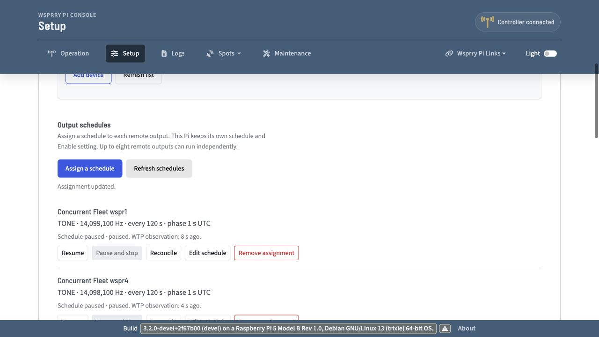

# Physical concurrent Pi/Pico Fleet test

Follow-up implementation, review and current acceptance status are recorded in
[the managed RP1/Fleet fix report](wtp-managed-rp1-fleet-fix-report.md).
The results below remain the historical pre-fix batch.

2026-10-01. WsprryPi `devel`, source commit
`6a32789cfb84881df9e6839b27a9538f69e7bed1`.

**Five physical remote targets passed three concurrent slots: 15 unique completed
jobs. The SDR observed wspr1, wspr4 and Pico B simultaneously in every slot.
The intended concurrent local wspr5 WSPR frame did not run.** Complete
central-local-plus-Fleet acceptance remains open.

All six endpoints independently reported empty, unowned and output inactive
afterward. All four normal managed Pi services are active. Every assignment is
paused and wspr5 local Enable is off. A normal controller restart preserved the
paused assignments and consumed slots without replay.

## Results

| Check | Result | Evidence and limit |
| --- | --- | --- |
| Five physical remote schedules | Passed | wspr1, wspr2, wspr4, Pico A and Pico B each completed three ten-second TONE jobs on common UTC slots. |
| Mixed physical Pi/Pico Fleet | Passed for this batch | Three Pi GPIO4 targets and two Pico PIO GP2 targets; no simulated target. |
| Repeated scheduling | Passed for three slots | Fifteen distinct completion records; simultaneous target-active observations in each slot. Sustained soak and disrupted-connection recovery were not tested. |
| Corresponding SDR signals | Passed for current combiner group | wspr1, wspr4 and Pico B observed together in all slots; corresponding carriers absent in sampled post-job windows. |
| Central local WSPR alongside Fleet | Failed | INI-driven RP1 scheduler remained inhibited despite direct CLI confirmation. No local backend work or completed frame was observed. |
| Browser Resume | Passed | Installed controller UI resumed all five assignments against physical devices. |
| Browser Pause and stop | Unverified | Native JavaScript confirmation blocked browser automation. Guarded HTTP pause ensured stopped state. |
| Stop and ownership release | Passed | Independent final STATUS on all six endpoints: empty, no owner/job, output inactive. |
| Receiver cleanup | Passed | Successful complete capture; stream deactivation, closure and device release verified. |
| Paused persistence | Passed | Normal managed restart retained assignments/consumed slots; five seconds of subsequent readback showed no replay. |

## Executed schedule

The binary/firmware identities and prepared configuration are retained in
[the preparation record](wtp-concurrent-fleet-preparation.md). No application,
component or UI source was changed for this run. The central application used
wspr5's installed binary, current INI and saved assignments. Remote targets used
Plain LAN WTP port 31417 and explicit device identities.

Each remote schedule had a 120-second period, UTC phase one second and finite
ten-second TONE jobs. Successful slots started at **10:54:01, 10:56:01 and
10:58:01 AM America/Chicago** (15:54:01, 15:56:01 and 15:58:01 UTC).

| Output | Requested frequency | Completed jobs | SDR observed here |
| --- | --- | --- | --- |
| wspr4 GPIO4 | 14.098100 MHz | 3 | Yes |
| wspr1 GPIO4 | 14.099100 MHz | 3 | Yes |
| Pico A PIO2 | 14.100100 MHz | 3 | Outside current combiner group |
| wspr2 GPIO4 | 14.101100 MHz | 3 | Outside current combiner group |
| Pico B PIO2 | 14.102100 MHz | 3 | Yes |
| wspr5 local GPIO20 | 14.097100 MHz WSPR base | 0 | Local scheduler inhibited |

An earlier attempt planned 10:48:01 AM. Browser API recovery exceeded the dispatch
lead, so all five targets selected 10:50:01 instead. That attempt was stopped
before its selected start and contributes no successful-job/RF count. The
consumed slot was preserved; the retry did not resubmit cancelled jobs.

The observer started the receiver before resuming schedules, polled real
controller/target status once per second, and independently disabled local
output and paused/stopped remote assignments at bounded deadlines. Private raw
observations remain on wspr5. Compact reports identify every job, slot,
authoritative completion, output-off state and successful cleanup; independent
final terminal records agree with all 15 completed job IDs. See
[controller-analysis.json](wtp-concurrent-fleet-results/controller-analysis.json).

## Corresponding SDR signals

The confirmed combiner taps were wspr1 GPIO4, wspr4 GPIO4, Pico B PIO2 and the
SDR on wspr5. The remaining test outputs were outside that receiver group.
Acceptance uses the operator's corresponding-signal criterion.

The existing native helper received from RSP1B `2404058C60` at 250 ksps, 200 kHz
bandwidth, centre 14.075100 MHz and 20 dB gain, with AGC/bias tee off. The complete
capture had zero timeouts, overflows and clipping samples, with verified cleanup.

Analysis used a 65,536-point Hann FFT every 0.5 seconds, searching ±300 Hz around
each expected offset. Noise masks excluded all six planned carriers. All sixteen
interior samples per slot (start +1 through +9 seconds) exceeded the 30 dB
peak-to-local-median-noise threshold for each observed device.

| Slot (Central) | Minimum wspr1 ratio | Minimum wspr4 ratio | Minimum Pico B ratio |
| --- | --- | --- | --- |
| 10:54:01 AM | 85.7 dB | 84.8 dB | 83.9 dB |
| 10:56:01 AM | 87.6 dB | 85.3 dB | 83.7 dB |
| 10:58:01 AM | 84.4 dB | 83.4 dB | 83.8 dB |

Post-job samples (start +13 through +18 seconds) stayed below 12.2 dB by the same
estimator. These are signal-detection ratios, not calibrated RF power, frequency
accuracy, spectral purity, decode or precision edge timing. No whole-chain
qualification was attempted.

The 922,000,000-byte capture remains on wspr5 at
`/home/pi/wtp-concurrent-fleet-run2-20toz4j4/capture.cf32`, SHA-256
`c121014619f53d4203a57ce48c8fbb3e4b0f172ded3cf3c7793e7039604a850a`.
Only compact evidence was copied back, using gzip during transfer. See
[rf-analysis.json](wtp-concurrent-fleet-results/rf-analysis.json) and
[capture.json](wtp-concurrent-fleet-results/capture.json).

## Local RP1 failure

Two current boundaries prevent the prepared local frame:

1. `scripts/route_application.py::inspect_service()` accepts the normal installed
   command and its `--no-web` variant. Adding
   `--rp1-development-confirmation-json` caused the startup helper to reject the
   managed service. The normal command was restored without changing that guard.
2. The binary was then launched in a bounded temporary service with the existing
   direct CLI confirmation and the same INI. Local Enable was admitted, but
   `src/scheduling.cpp::runtime_transmit_preparation_enabled()` limits its RP1
   WSPR preparation exception to `!use_ini`. The INI scheduler stayed inhibited
   before binding its operation through the confirmation bridge. Logs reported
   `Transmissions disabled.`; all local-work samples were false. Local Enable
   was returned to off.

The successful remote batch used that temporary controller service. This is
**not** a successful managed-service concurrent-local qualification. Provider
and kernel output gates were not weakened. Supporting bounded local RP1
authorization in the managed scheduler and startup contract is the next
implementation step, followed by rerunning concurrent local-plus-Fleet testing.

## Browser and restoration

Impeccable's Operate guidance was applied to the incumbent installed UI. Five
actual Resume controls succeeded. Desktop live feedback/stopped controls were
rendered and inspected. The unchanged UI's desktop/mobile paused views are in
the preparation record; no new mobile run was performed after browser blocking.
Fleet visibility was revealed for the test browser session only. No UI source
was edited.

After the batch, Pico B was briefly resumed to test Pause and stop before another
RF slot. Native `confirm()` blocked in-app browser automation, including dialog
and close APIs. That browser result remains unverified. The temporary controller
reached its bounded lifetime and exited; the normal service was restored and a
guarded HTTP pause ensured the assignment remained paused. No additional
completed RF job was recorded.

Final independent HELLO/STATUS probes verified all six identities and stopped
states. wspr5 was restarted once more with all assignments paused; assignments
and consumed slots stayed unchanged, with no replay. All four managed services
were checked active. The temporary command was removed, the original RP1
reconciliation drop-in retained, the temporary controller stopped and the SDR
capture process absent. GPIO-only backend choices and the approved Fleet
frequency override were retained.

See [final-device-status.json](wtp-concurrent-fleet-results/final-device-status.json),
[persistence.json](wtp-concurrent-fleet-results/persistence.json) and
[restored-services.json](wtp-concurrent-fleet-results/restored-services.json).
Private pretest archives remain on wspr5; credentials/full configuration archives
are excluded from repository evidence.

## Evidence review and remaining work

The adversarial evidence pass checked distinct jobs/common slots, authoritative
completion/output-off records, simultaneous target-active observations, final
terminal records, receiver integrity/cleanup and paused persistence. It rejected
local Enable/local-effective state as evidence of physical local transmission,
and an attempted browser stop as a completed workflow. The abandoned attempt is
kept separately and contributes no pass count.

Remaining acceptance:

- Implement managed local RP1 authorization, then complete a local WSPR frame
  while all five remote schedules run.
- Rotate the stopped combiner to wspr2, Pico A and wspr5 for corresponding SDR
  observation. wspr2/Pico A have completion evidence here, but no receiver
  observation from this batch.
- Complete browser Pause and stop and both live local-takeover choices after
  resolving the native-confirmation automation block.
- Eight remote slots using isolated simulated endpoints, separate from the five
  physical targets; sustained recurrence/reconnection testing.
- Planned discovery link loss, address changes, multihomed recovery and cache
  expiry acceptance. No topology changes were exercised here.

## Validation and Documentation Impact

- Passed: live three-slot Fleet batch, compact controller evidence assertions,
  native SDR capture/detection analysis, final device probes, managed paused
  restart check and final service checks.
- Passed: `python3 -m py_compile` for recorded acceptance scripts; final JSON
  assertions, `git diff --check` and staged diff check.
- Failed/unverified: concurrent INI-driven RP1 local WSPR; browser native stop
  confirmation. These remain open above.
- Not run: source semantics/CI suites because application/component/UI source
  was unchanged; second RF group, eight-slot scale, soak and discovery changes.
- Updated: this development report, compact evidence and a result link in the
  preparation record.
- Considered and unchanged: `docs/wtp-fleet.md`, `docs/wtp-pi-operation.md` and
  sibling operator documentation. The test changes no shipped operator behavior.
  Operator documentation requires review with later managed-RP1 implementation.

No component source paths were modified. Branch remains `devel` with new
preparation/result artifacts untracked. Nothing was committed or pushed.
