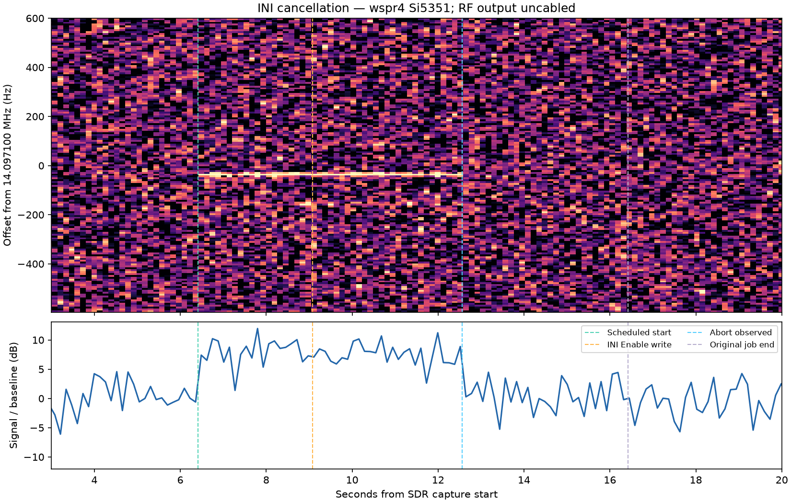

# Physical INI-triggered cancellation

Date: 2026-09-30. Application branch: `devel`, revision
`ff632d58dfcd6ada32470467e45769d0ba4aa218`.

**Result: passed under the operator's corresponding-SDR-signal criterion.**
An external INI Enable transaction cancelled the active remote job, released
ownership, closed remote admission and gave local control precedence.

The operator clarified after the run that the Si5351 board remains connected
to wspr4, but its RF output is disconnected from the SDR setup. The wspr5
recording nevertheless shows a narrowband signal matching the scheduled start
and early cancellation, consistent with pickup from the uncabled output.
No conducted RF-path, calibrated power/frequency, or complete-chain
qualification is claimed or required for this acceptance.

## Test and observations

- Used the preserved wspr4 isolated Si5351 executable and a fresh private INI
  at `/home/pi/wtp-ini-validation.pW1gkI/validation.ini`, WTP port 31418.
  The binary hash matches the previous final native build. Of 526 source/header
  hashes compared with current source, only the subsequently repaired Fleet
  test differs; production source matches.
- Loaded and armed a ten-second TONE job at 14.097100 MHz, scheduled for
  `2026-09-30T11:59:37Z`. Local scheduling was disabled and its next slot placed
  approximately thirty minutes in the future.
- Confirmed the job was running and output active. Changed only
  `[Operation] Transmit` from `false` to `true` in the private INI using a
  noninteractive file writer. The write completed at
  `2026-09-30T11:59:39.661586Z`. No HTTP configuration write or interactive
  takeover action triggered this cancellation.
- The runtime logged `INI file changed, reloading` at
  `2026-09-30T11:59:43.086Z`. The remote job was observed Aborted at
  `2026-09-30T11:59:43.147295Z`, before its original ten-second end.
- Output was inactive and known off; remote owner was empty; local requested
  and effective Enable were true; remote admission was closed; revocation
  generation advanced from 9 to 10. No local scheduled transmission started.
- A new controller's CLAIM was rejected with BUSY while local Enable remained
  effective. The test controller did not send ABORT until cleanup at
  `11:59:57Z`, after all cancellation observations and the completed capture.

**Timing qualification:** observed file-write-to-abort latency was **3.486 s**.
The existing MonitorFile implementation polls every second and requires three
stable checks before reporting the change. Once reported, the INI transaction
aborted the remote job rather than waiting for its natural completion. This is
not a claim of zero latency from a disk write or a measured worst-case bound.
No polling or debounce behavior was changed for this test.

## SDR evidence

The bounded capture contains 6,250,000 complex samples over 25 seconds at
250 ksample/s, with no overflows or clipped samples and verified receiver
cleanup. The signal appears near the commanded frequency during the job and
disappears near the observed abort, well before the original scheduled end.
Its median level was 8.75 dB above the pre-job baseline, falling by 9.01 dB
after cancellation to approximately that baseline. These descriptive values
are uncalibrated and are not additional acceptance thresholds.

- [Protocol, INI write and endpoint observations](ini-cancellation.json)
- [Capture metadata and raw-IQ hash/path](ini-cancel.json)
- [Descriptive SDR analysis](sdr-analysis.json)
- [Runtime reload/shutdown log](runtime.txt)
- [Identity, operator clarification and restoration](identity-and-restoration.json)

Raw IQ remains at `/home/pi/wtp-ini-capture.kdILz5/ini-cancel.cf32` on wspr5 and
in `/private/tmp/wtp-ini-evidence/ini-cancel.cf32` on the Mac. Its SHA-256 is
`c1c433ef1ddd9f27670edb2ec5e6abab263daa465acd62b4e8d21c72eed64e1c`.

The [initial automated analysis](sdr-initial-analysis.json) is retained as a
rejected analysis attempt: it imposed unrequested 10/15 dB thresholds, and its
edge detector's threshold fell below the noise floor. Its `passed=false` and
edge times are not the acceptance decision. The final analysis reports measured
contrast without those gates; direct visual review of the recorded signal uses
the operator's stated visibility criterion. No replacement RF run was needed.

## Restoration and review

The test process exited cleanly and wspr4's original installed service was
restored active with `ExecMainStatus=0`. The installed INI hash is unchanged.
The wspr5 service retained the same PID and INI hash; its capture helper exited
with verified SDR release. No test transmitter or capture process remains.

The cleanup INI Disable write had not yet been observed at the one-second
cleanup status snapshot; the isolated process was then stopped and the
original service restored. The cleanup snapshot is retained as observed,
without presenting it as a successful Disable reload.

Review confirmed cancellation preceded natural completion, no controller ABORT
caused it, takeover used the actual file-monitor path, local priority survived
a fresh claim attempt, and RF observation was recorded with the operator's
connection clarification. Installed-service upgrade/boot/restart acceptance,
Fleet scale, browser-to-device workflows and other failure scenarios remain
separate tests. This closes only the remaining physical INI takeover variant.

## Reproduction and documentation impact

The exact run's scripts are retained in [reproduction](reproduction/): launcher,
INI-only writer, controller/capture runner and SDR analysis. They contain this
run's specific paths; inspect and provide fresh stage/output paths before reuse.
The controller was run as `python3 /private/tmp/wtp-ini-cancel-run.py`; analysis
used the existing `/private/tmp/wtp-pi-plot-venv/bin/python` environment.

Only development evidence was added. No application, reusable component, UI,
installed binary or operator configuration was changed. Operator instructions
in `docs/wtp-pi-operation.md` already describe noninteractive INI cancellation;
no operator documentation change is required. This acceptance evidence is
recorded separately from application implementation changes.
