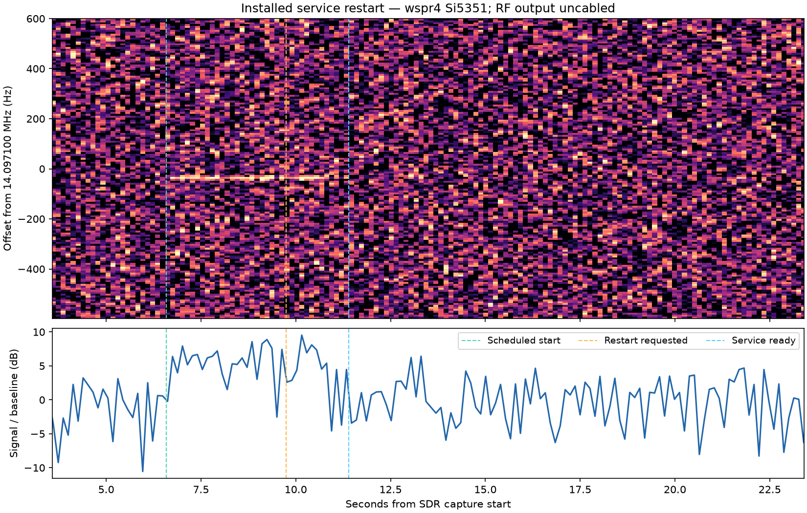

# Installed service acceptance — wspr4

**2026-09-30: eight installed-runtime checks passed. The source upgrade passed;
the precompiled installer has an unresolved DNS-SD dependency defect.**

The original wspr4 application, configuration, web files and service definitions
were restored and verified against the pre-test inventory. The wspr5 application
service remained running throughout. This record closes the tested service
lifecycle scenarios, not every installation path or the broader failure matrix.

## Tested installation

| Item | Evidence |
| --- | --- |
| Source | `devel`, `ff632d58dfcd6ada32470467e45769d0ba4aa218` |
| Host | wspr4, Raspberry Pi 4, Debian 13 Trixie, aarch64 |
| Installed version | `3.2.0-devel+ff632d5 (devel)` |
| Build | Native release; `BACKENDS=si5351,simulated ANCILLARY_GPIO=0`; two jobs; warnings treated as errors |
| Installed executable SHA-256 | `0611a539a403e6e15dbc5b500b0d685e920ad21071d953cf825f6792fe96315f` |
| Managed unit | `/etc/systemd/system/wsprrypi.service` |
| Managed command | `/usr/local/bin/wsprrypi -J -i /usr/local/etc/wsprrypi.ini` |
| Controller | WTP/HTTP probe running on wspr5, coordinated from the Mac |
| Physical job | Si5351 TONE, 14.097100 MHz, finite 30-second plan interrupted by service restart |
| Receiver | SDR on wspr5; wspr4 RF output remained uncabled |

The binary was freshly compiled and published by the normal source installer.
The installer verified runtime readiness and exited successfully; only then did
the invoking shell create `/home/pi/finished`. The completed installation marker
was moved into the campaign evidence during restoration, returning its original
home-directory location to absent.

The source-install command, run inside the separate checkout on wspr4, was:

```sh
rm -f /home/pi/finished
sudo -n env TERM=xterm REPO_BRANCH=devel \
  BACKENDS=si5351,simulated ANCILLARY_GPIO=0 MAKEFLAGS=-j2 JOBS=2 \
  LOG_FILE=/home/pi/wtp-installed-validation.yTbN3G/source-installer.log \
  ./scripts/install.sh && touch /home/pi/finished
```

## Results

| Check | Result and observed evidence |
| --- | --- |
| Existing installation upgraded through source installer | **PASS.** Native compilation, binary publication, configuration merge, UI publication, Apache configuration and installed runtime-readiness validation succeeded. |
| Installed startup | **PASS.** Managed process loaded the test INI, listened on port 31417, reported Si5351 CAPS and accepted a claim. |
| Real reboot with local Enable off | **PASS.** Host boot ID changed, device ID remained stable, no owner/job/output uncertainty was inherited, and a new remote claim succeeded. |
| Real reboot with local Enable on | **PASS.** Local requested/effective Enable survived through `Enable on Boot=Follow`; remote admission stayed closed and CLAIM returned a failure. Local scheduling was placed outside the test window. |
| Service restart while remotely owned but idle | **PASS.** The old owner was cleared, WTP boot identity changed, device identity stayed stable, output was known off, and a new claim succeeded. |
| Service restart during physical remote work | **PASS.** A running remote tone was interrupted. The restarted process reported output inactive, no owner/job and no uncertainty. ARM for the old job without a new claim was rejected; the old job did not reappear. |
| Service restart with an armed future job | **PASS.** The old job did not execute at its former start time or reappear after restart. |
| Invalid persistent takeover journal | **PASS.** A deliberately malformed journal inhibited the listener; a WTP connection failed. Restoring the latest valid journal restored admission. |
| Persisted Fleet recovery barrier | **PASS, synthetic state.** A private persisted in-flight assignment stayed `recovery_required`, retaining its consumed slot and in-flight marker across another service restart. It was not automatically dispatched or cleared. |

The eight runtime assertions are recorded in [service-tests.json](service-tests.json).
The Fleet test used a synthetic Pico-shaped assignment and an unreachable test
address. It is evidence of installed persistence/recovery behavior; it is not a
physical Pico interop test, actual controller-crash test or live resumption test.

Two real host reboots were verified using these boot identities:

1. `522d9aa1-8a52-4bf9-b058-be069a1bb366` → `848e9ebb-b75f-4dd3-a2aa-ce1249e31c1d`
2. `848e9ebb-b75f-4dd3-a2aa-ce1249e31c1d` → `fbc9c1f5-1801-40d3-8e3d-8e282b565649`

Device identity stayed `74d12151aff03c45cfcb15a45bd8e037`.
The takeover journal advanced from generation 10 to 12 and retained root ownership
and mode 0600. The current boot's service journal is saved; the host has no
persistent previous-boot journal. Reboot results therefore use the recorded live
boot IDs, API observations and protocol responses, not historical journal claims.

## Physical restart observation

The SDR waterfall shows a corresponding narrow signal during the remote tone,
then its disappearance during service restart. The observed signal was about
6.18 dB above its pre-job baseline and dropped about 6.01 dB after restart.
The new service was observable 1.662 seconds after the restart request, well
before the job's original end. The receiver retained 7,500,000 samples with zero
overflows, zero clipped samples and verified cleanup.

This passes the user's corresponding-SDR-signal criterion. It does not establish
calibrated frequency/power, spectral quality or a precise hardware stop latency.



Analysis: [sdr-analysis.json](sdr-analysis.json).
Capture metadata: [restart.json](restart.json).
Raw IQ is retained on wspr5 at
`/home/pi/wtp-installed-controller.so4gXb/restart.cf32` with SHA-256
`03e66a2554bfed0f6f9b5355c5bd9c18bc8496ac288e96b660cb8c4bbb51117e`.
It is not added to the repository.

## Unresolved installer finding

**The supported precompiled/local-binary path rejects DNS-SD-enabled binaries.**
The first live installation attempt stopped before replacing the application:

```
Precompiled executable rejected: unsupported libraries for trixie:
['libavahi-client.so.3', 'libavahi-common.so.3']
```

`scripts/precompiled_binary.py:inspect()` lacks mappings for these runtime
SONAMEs, although the installer's runtime package list includes
`libavahi-client3`. [after-rejected-install.json](after-rejected-install.json)
shows no changes to the preserved installation files after rejection.
The subsequent source install succeeded without bypassing this validation gate.

Required follow-up: add the correct Avahi SONAME/package mappings, cover them in
`precompiled_binary_test.py` for the supported architecture/OS matrix while
retaining unknown-library rejection, and rerun the live precompiled install.
Application source and installer behavior were not edited during this test task.

The first noninteractive preflight also lacked TERM and exited in `tput` before
installation. Setting `TERM=xterm` allowed the preflight to pass. The precompiled
attempt's introductory metadata used the installer's default `main` label even
though the separate checkout was on `devel`; the later source-install invocation
set `REPO_BRANCH=devel` explicitly. Both existing Pi checkouts stayed on `devel`
and clean.

## Restoration

[restored-file-differences.json](restored-file-differences.json) is empty: all 344
entries in the original scoped inventory matched by contents, owner/group,
permissions and symlink target after restoration. The inventory covered the
application, INI files, runtime companions and manifest, web root, Apache
configuration, service definitions/enablement, and relevant boot/module files.

- Original executable SHA-256: `c9c9b94cf5299b66a1764706a26d4af92928c563ad527ceb6002db19244dd176`.
- Original INI SHA-256: `cdab1a816495325ebe4dfe8d3f453c2ce89f430f7e9d84befda4fc9ff12ff5cb`.
- wspr4 original service: active, enabled, PID 3279, exit status 0; Apache active/enabled; configuration API reachable from wspr5 with HTTP 200.
- wspr5 service: original PID 1966, active, unchanged boot ID and INI hash; no capture process left running.
- Synthetic assignment removed from the active configuration path and retained with campaign evidence.
- Latest valid takeover journal retained at generation 12. It was deliberately not rewound to generation 10.

The installer added `libavahi-client-dev`, `libavahi-common-dev`, and
`libdbus-1-dev`, and updated four OpenSSL packages. These system packages remain
installed; they were not removed or downgraded as part of application restoration.
Exact versions are recorded in [package-changes.json](package-changes.json).
Installer logs, UI backup history and isolated campaign files also remain.

The private root-owned rollback archive remains on wspr4 at
`/home/pi/wtp-installed-validation.yTbN3G/baseline.tar` (SHA-256
`73228f609996d807fb7635b1deb9da86452881dd16bdc8728034fc163958fdd7`).
It contains private host configuration and is intentionally not in the repository.

## Review and remaining scope

Review confirmed that all runtime assertions used the real installed service,
that the RF result has corresponding SDR evidence, that restored file hashes
match, and that generation history was not rewound. The installer defect remains
open and prevents calling the entire installation area complete.

Still not covered by this campaign:

- Precompiled installation after the dependency-validation fix, and installation
  on a clean OS image. This run exercised upgrade of an existing installation.
- Actual controller crash/disconnect, lost replies, target power loss, injected
  clock loss/missed starts, or output-off failure.
- Live reconciliation/resumption of an interrupted Fleet job, eight live targets,
  mixed physical Pi/Pico fleets, and sustained scheduling/reconnection.
- Both takeover choices and Fleet configuration through a browser connected to
  actual Pis. Mocked browser tests and direct HTTP tests remain separate evidence.
- Discovery during link loss, address changes and multihomed recovery, plus
  confirmed expiry of the residual cache entry. Avahi restart recovery and
  selected-interface withdrawal were already covered separately.

The physical takeover variants are closed: **Let it finish**, direct HTTP Enable
cancellation, and [noninteractive INI Enable cancellation](../wtp-ini-cancellation-results/README.md)
have corresponding live-device evidence. They do not remain in the test backlog.

No broader Linux/Mac semantics rerun was needed: no application source changed.
No UI edits or browser acceptance occurred. Si5351 was the selected physical
route; GPIO/RP1 qualification is unaffected.

## Documentation Impact

Updated this development evidence record and its scripts/logs. Reviewed the
existing Pi endpoint/Fleet contracts and the operator configuration runtime
page covering boot policy and the takeover journal. Operator behavior was not
changed, so no operator documentation edits were needed. The sibling operator
documentation repository was not modified.

## Reproduction and repository state

The scripts record this specific authorized campaign, with explicit host names,
paths and assumptions. They are not unattended general-purpose tests. `run.py`
requires a successful installation, staged helpers, verified rollback archive and
explicit live service/RF authorization. See [run.py](run.py),
[controller_rpc.py](controller_rpc.py), [snapshot.py](snapshot.py) and
[analyze_sdr.py](analyze_sdr.py).

Script syntax checks and `git diff --check` passed. Repository branch remains
`devel`. Application/component files were not modified. This acceptance evidence
and the physical INI cancellation evidence are recorded separately from
application implementation changes.
