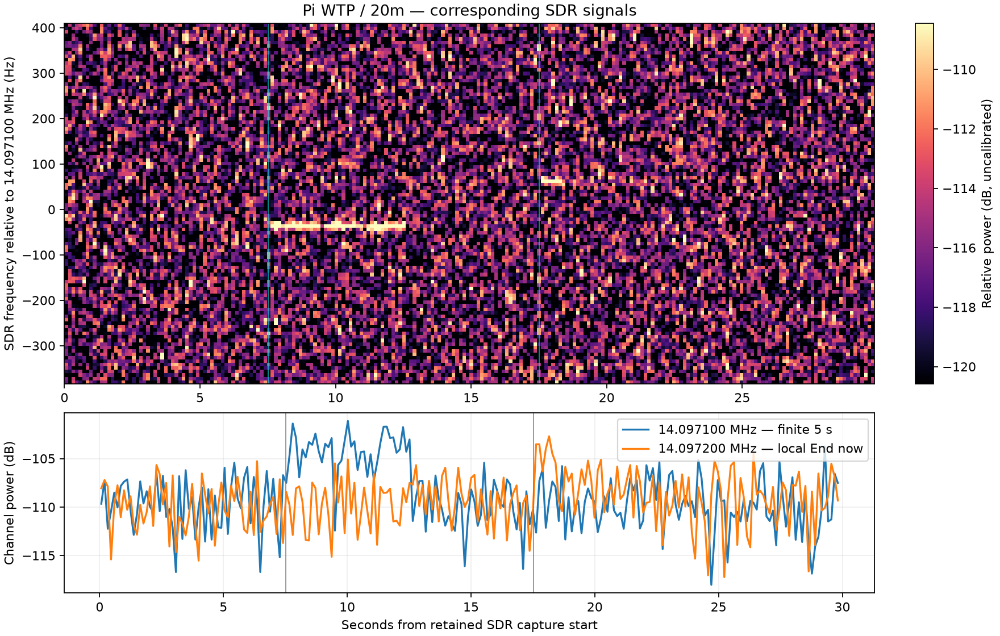

# Pi WTP implementation and acceptance record

Historical first-adapter acceptance. The initial tone-only limits below are
superseded by the [backend capability correction](wtp-backend-capabilities-report.md).

Execution date: 2026-09-29. Repository branch: `devel`.
Starting revision: `b28d01333744f8562fd8a9ad28908cedc61d98c3`.

**Outcome:** Implemented and accepted for the bounded first Pi route below.
The final adversarial reassessment found no unresolved material issue in that
scope. Broader route/mode qualification and the separate documentation follow-up
remain explicitly outside this result.

The [execution prompt](wtp-pi-implementation-prompt.md),
[local contract](../wtp-pi-endpoint-contract.md), and
[operation reference](../wtp-pi-operation.md) define the scope. WTP/1 protocol
and portable server sources are pinned to WsprryPico
`c13fc16819749e9b53a42609f31702c3aca9931c`.

## Implemented behavior

- A managed Pi exposes a Plain LAN WTP endpoint, default TCP 31417, with saved
  listener/interface configuration and a transient command-line port override.
- DNS-SD advertises the actual listener and selected station address. Avahi
  failure leaves direct WTP available and publication retries after recovery.
- Local Enable, inbound admission, and outbound assignments are independent.
  Local Enable takes priority, including idle gaps. Target-local interactive
  takeover offers End now, Let it finish, and Cancel. Enabled INI transactions
  and direct HTTP Enable writes immediately cancel remote work.
- A durable target generation removes central assignments after local takeover,
  including while the controller is offline. No controller approval is involved.
- The central Pi maintains up to eight explicit independent remote schedules
  alongside its own local schedule. Identity exclusion includes the legacy
  single-target WTP route. Consumed slots are not retried after failure/restart;
  unresolved prior dispatch requires reconciliation.
- The initial Pi physical server route is Si5351 finite TONE on 20m, up to
  ten seconds, with an optional canonical terminal RF-off marker. Other Pi
  physical routes/modes are rejected. Controller assignment modes remain
  capability checked for Pi/Pico endpoints.
- The Fleet UI remains behind the existing development gate.

Components changed: `WsprryPi-UI`, new portable `src/WTP-Server`, and the narrow
Si5351 adapter in `src/WSPR-Transmitter`. Parent configuration, scheduling,
HTTP, discovery and WTP integration coordinate these components.

## Automated validation

Commands below ran from `src` unless a directory is stated. On macOS the build
used `SDKROOT=/Applications/Xcode.app/Contents/Developer/Platforms/MacOSX.platform/Developer/SDKs/MacOSX26.5.sdk`,
`MACOSX_DEPLOYMENT_TARGET=26.5`, and `CXX='c++ -Wno-deprecated-declarations'`.

| Commands / coverage | Result |
| --- | --- |
| `make semantics-test-portable SUDO=` | Passed; explicit simulated-only portable subset. |
| `make wtp-pi-authority-test wtp-pi-listener-test wtp-pi-revocation-test wtp-pi-tone-engine-test wtp-pi-identity-test wtp-pi-interface-selection-test wtp-pi-si5351-realization-test wtp-pi-control-test SUDO=` | Passed. |
| `make wtp-fleet-test wtp-pi-config-transaction-test BACKENDS=simulated ANCILLARY_GPIO=0 SUDO=` | Passed, including real manager shutdown/crash-marker preservation and config transaction boundaries. |
| `make wtp-production-test wtp-api-test privileged-network-policy-test wtp-catalog-test BACKENDS=simulated ANCILLARY_GPIO=0 SUDO=` | Passed; production test reports 257 checks. |
| `make -C WTP-Server test` | Passed standalone portable server core. |
| `make si5351-transition-test` in `src/WSPR-Transmitter/src` on Linux | Passed with fake I2C; enable admission, duration anchoring and disable readback included. |
| `npm test` in `WsprryPi-UI` | Passed. |
| `node tests/wtp_pi_fleet_ui_integration_test.js` in `WsprryPi-UI` | Passed rendered browser workflow with mocked device responses. |
| `node tests/wtp_network_ui_integration_test.js` in `WsprryPi-UI` | Passed existing network workflow regression. |

Native Pi validation uses the explicit `BACKENDS=si5351,simulated ANCILLARY_GPIO=0`
profile and extracted Avahi development headers with the installed runtime
libraries. The full default Linux semantics profile was not run: its libgpiod
C++ development-header requirement was unavailable on this selected test host.
The portable suite is not a claim that the full Linux profile passed. CI recipes
now include the new endpoint/fleet and browser tests; remote CI is a separate run.

Observed build warnings: macOS SDK/deployment mismatch with the installed
OpenSSL 4 libraries, expected `/proc/device-tree/model` fixture messages on
macOS, and missing Avahi pkg-config metadata on the Pi despite explicit valid
include/link flags. Negative tests deliberately produce rejected handshake,
invalid-input and occupied-port messages. None is RF evidence.

## Live software acceptance

The runs used isolated binaries and private INI copies. The installed binary
and INI were not replaced. Original managed services were stopped only while
the corresponding isolated instance held the existing singleton.

| Check | Evidence |
| --- | --- |
| wspr4 simulated finite job, local End now, Let it finish, and direct HTTP Enable | [job](wtp-pi-results/wspr4-sim-job.json), [end now](wtp-pi-results/wspr4-sim-end-now.json), [finish](wtp-pi-results/wspr4-sim-finish.json), [HTTP](wtp-pi-results/wspr4-sim-http-enable.json) |
| wspr2 enabled INI immediate cancellation, singleton refusal, explicit simulation retained across reload | [INI and singleton](wtp-pi-results/wspr2-ini-singleton.json) |
| wspr5 central local work plus wspr4 and wspr2 independent finite schedules, followed by target-local assignment removal | [multi-Pi result](wtp-pi-results/multi-pi-fleet.json) |
| Paused assignment saved, central stopped, target enabled then disabled, central restarted and assignment removed | [before](wtp-pi-results/offline-takeover-before.json), [target](wtp-pi-results/offline-takeover-target.json), [after](wtp-pi-results/offline-takeover-after.json) |
| Avahi outage and recovery while direct WTP remains reachable | [restart result](wtp-pi-results/avahi-restart.json) |

These simulated jobs qualify software behavior only.

## UI and Impeccable review

The established Bootstrap interface and local feedback pattern were retained.
Browser coverage exercised declined confirmation, both accepted takeover choices,
independent assignments, stale-revision draft preservation, and the development
gate. Desktop and mobile screenshots cover outputs, assignment, listener, and
local takeover in [the UI evidence directory](wtp-pi-results/ui/).

Impeccable's detector was run once and returned no detections. Its required
separate finish reviewer found disabled-button contrast, missing focus return
after closing takeover, and obsolete Pico-only introduction wording. All three
were repaired and rechecked; the scoped disposition was ship. The required
documenter reviewed all eight rendered screenshots and found the existing
`DESIGN.md` sufficient for this extension. The dedicated preset launcher was
unavailable, so the skill's separate-agent role fallback was used. This is a
review of the changed workflow, not a claim about every screen in the product.

## Adversarial review and repairs

The review covered local/remote ownership races, replay, retained sessions,
unconfirmed output-off, lost replies, malformed private state, stale assignments,
identity mismatch, Plain LAN binding, restart, configuration persistence and UI
confirmation bypass. Iteration included source tests and live cross-Pi probes.

| Finding | Repair and reassessment |
| --- | --- |
| New local HTTP routes were omitted from the existing protected route classification. | Added endpoint/fleet route classification and API/policy regressions. |
| Native assignment validation expected eight fields while the documented UI supplied seven. | Corrected the exact field count; added a production-manager API regression and passed live assignment creation. |
| Ordinary multihomed hostnames could resolve away from the deliberately bound WTP address. | Publish a unique endpoint SRV hostname and selected-address A record; verify live Pi/Pico discovery. |
| Avahi resolver TXT was reversed even though the callback already supplied wire order. | Removed the reversal; verified txtvers-first records on the wire and in discovery. |
| Avahi browser could outlive its discovery map during static destruction. | Construct the map before the browser; repeated clean stop with active discovery. |
| Server rejected the native controller's canonical one-nanosecond terminal RF-off event. | Accept only that exact optional tail and advertise truthful event/duration limits; added engine regression and live fleet run. |
| Fleet preparation did not carry the current experimental frequency permission. | Read the current config snapshot at validation, preparation and admission; retain the existing frequency policy. |
| A queued future slot delayed generation reconciliation. | Reconcile while waiting as well as while idle/paused, before CLAIM/ARM. Live takeover removed the assignment. |
| Shutdown of an empty context could erase a previous process's unresolved dispatch marker. | Track whether this context dispatched; retain old uncertainty until explicit reconciliation. Real manager regression passed. |
| Private-state readers could block on nonregular files. | Reject nonregular files with nonblocking open and private-file checks; FIFO regressions passed. |
| Explicit simulated CLI selection could be lost across INI/HTTP reloads; its early parser also handled case differently. | Preserve a process-only override and use the normal backend parser during the early scan. Enabled physical-INI/uppercase simulation regression passed. |
| A transferred native build retained old component object code and bypassed the new physical hooks. | Debugger proved the old Config layout. Force all native objects/libraries to rebuild; do not count the failed physical probes as acceptance. |
| Engine could trust a backend success result without observing output enable. | Require the launch observation for Complete; a no-enable backend regression now fails the job. |

## Physical acceptance and restoration

**RF accepted:** wspr4's Si5351 WTP endpoint generated a finite five-second tone
at 14.097100 MHz, then a five-second job at 14.097200 MHz that was ended early
by target-local End now. The wspr5 SDR recording shows the corresponding
five-second signal and the shorter second signal. Both protocol results confirm
output inactive afterward; the first is Complete and the second Aborted.



Evidence: [finite tone](wtp-pi-results/wspr4-rf-tone.json),
[local abort](wtp-pi-results/wspr4-rf-end-now.json), and
[SDR analysis](wtp-pi-results/sdr-20m.json). The retained capture started
`2026-09-29T20:46:05.483Z`, contains 7,500,000 complex samples at 250 ksample/s,
and ended with verified receiver cleanup. The plot uses 32,768-sample Hann FFT
blocks. Its frequency axis and power are uncalibrated. The two observed enable
callbacks were about 0.502 ms and 0.460 ms after their monotonic targets; those
two observations do not establish a worst-case timing guarantee.

The final native build was forced from source with:

```sh
make -B -j3 JOBS=3 debug wtp-pi-config-transaction-test wtp-fleet-test \
  BACKENDS=si5351,simulated ANCILLARY_GPIO=0 SUDO= AVAHI_AVAILABLE=1 \
  AVAHI_CFLAGS='-I../validation-deps/root/usr/include -DWSPRRYPI_HAVE_AVAHI' \
  AVAHI_LIBS='-l:libavahi-client.so.3 -l:libavahi-common.so.3'
```

A subsequent normal build included the final observed-launch check and corrected
revision metadata, running `debug wtp-pi-tone-engine-test wtp-pi-listener-test
wtp-production-test` with the same profile/Avahi flags. All passed. The Si5351
component was independently rebuilt with `make -B -j2 si5351-transition-test`
and passed. The final listener regression includes eight concurrent clients,
refusal of a ninth, and restart. Final macOS authority, tone, config-transaction
and fleet regressions also passed after the repairs.

[Native identity](wtp-pi-results/native-build.json) records binary SHA-256
`375a2fa4efc86dceab58db93fa362d5b16af0ebab563b30f97fccba45b0b6866`.
All 519 source/header files matched the local
[source manifest](wtp-pi-results/source-sha256.json). Its metadata correctly
reports the starting revision plus a dirty working tree. Earlier simulated
records carry the isolated stage's older version label; that label must not be
used as their source identity or as evidence that the later RF repair was present.
The failed physical attempts used stale component objects, were retained as
diagnostic evidence, and were not counted as acceptance.

[Port discovery](wtp-pi-results/cli-port-discovery.json) verified SRV port 31418
from the command-line override. [Listener withdrawal](wtp-pi-results/listener-withdrawal.json)
verified saved INI port 31417, disabled TCP admission, publication stopped, and
the controller's selected Ethernet interface observing the goodbye. Another
controller interface retained a cached mDNS entry; independent interface caches
can expire later. Discovery is a candidate list and never substitutes for a
live WTP identity/status exchange.

The final wspr4 physical instance and wspr5 central instance both exited cleanly
with launcher exit status zero. Original `wsprrypi.service` instances on wspr4,
wspr2 and wspr5 were verified active with `ExecMainStatus=0`, and no isolated
test transmitter or SDR capture process remained. See the
[restoration record](wtp-pi-results/restoration.json). No installed binary or
installed INI was replaced. Private stage files remain available for evidence;
the durable takeover journals were preserved.

### Final adversarial reassessment

The repaired ownership, configuration, persistence, UI, discovery, protocol
adapter and physical launch/cleanup paths were re-examined after the final
changes. The observed-launch regression prevents a backend's no-op success from
being reported as a completed transmission. Fresh native RF completion and local
abort, TCP withdrawal, selected-interface DNS-SD removal, clean shutdown, and
service restoration close the live findings. No unresolved material finding
remains within the stated initial-route scope. The independent-interface mDNS
cache observation and the unrun full Linux profile are recorded limitations,
not concealed passes.

## Documentation Impact

Updated in this repository: README links, endpoint contract, this prompt/report,
Pi endpoint operation, fleet assignment reference, simulated-backend reference,
validation probe usage, and portable server component provenance/README.

Considered unchanged: `WsprryPi-UI/DESIGN.md` (existing design rules cover the
extension), WsprryPico protocol (pinned/reused without a wire revision), and the
sibling operator documentation repository (read-only scope).

Operator documentation still required in `../Wsprry_Pi_Docs`: local takeover
and Fleet controls in `docs/User_Interface/index.md` and
`docs/User_Interface/Setup/index.md`; endpoint/fleet resources in
`docs/Advanced_Operations/rest_api.md`; `[WTP Server]` and independent Enable
semantics in `docs/Advanced_Operations/ini_configuration.md` and its
`runtime.md` / `complete_example.md` pages; finite Pi server capability and
port override in `docs/Command_Line_Operations/transmitter_backends.md` and
`docs/Command_Line_Operations/service_test_controls.md`. That separate repository
was not modified because cross-repository writing was not authorized.

Other physical backends, additional Pi server modes, calibrated frequency,
spectral performance and long-duration timing remain outside this first route's
acceptance. The operator-authorized RF criterion here is a corresponding SDR
signal; no complete RF-chain inventory is required or claimed.
